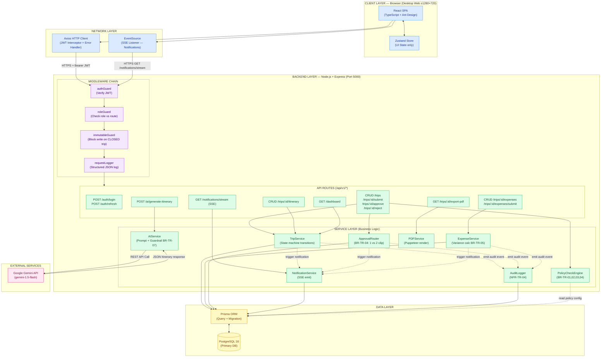
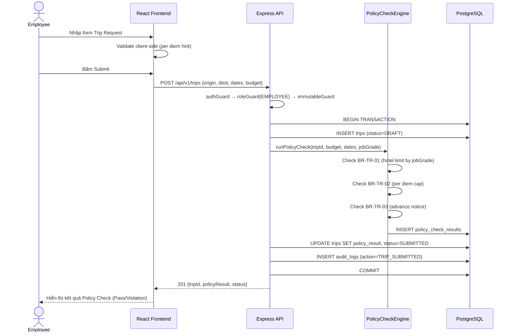
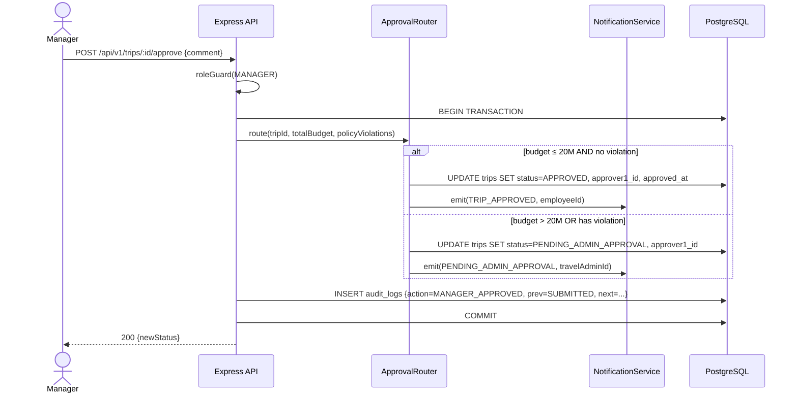
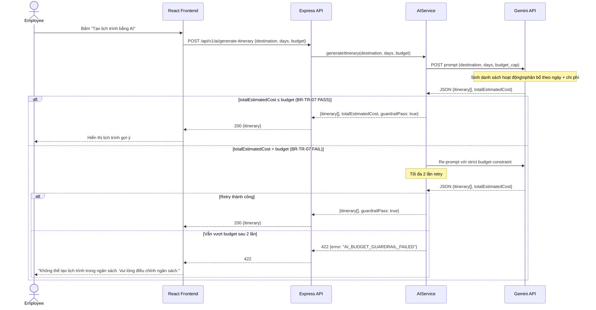
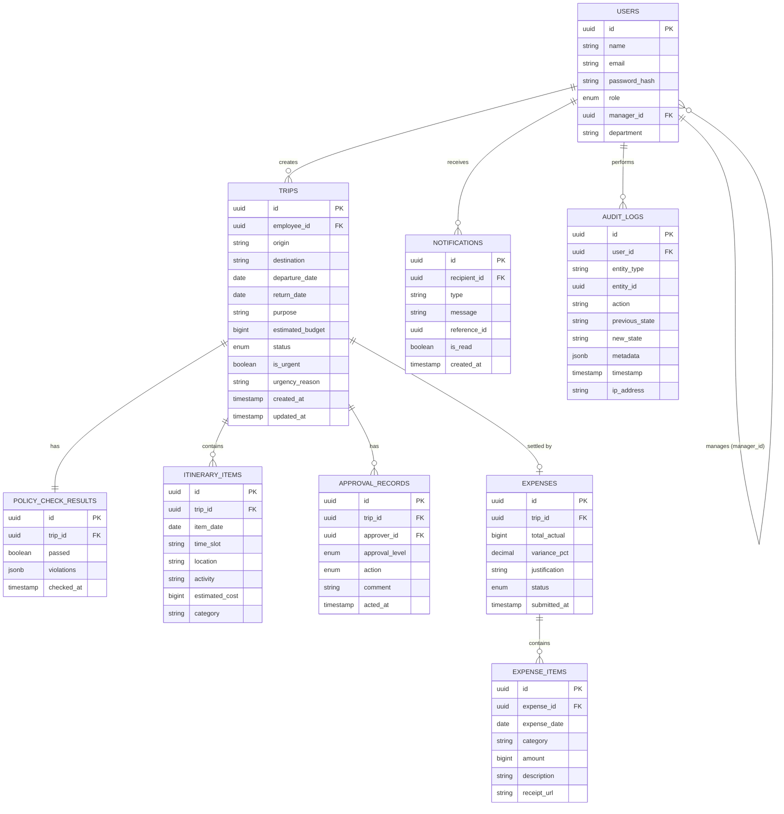
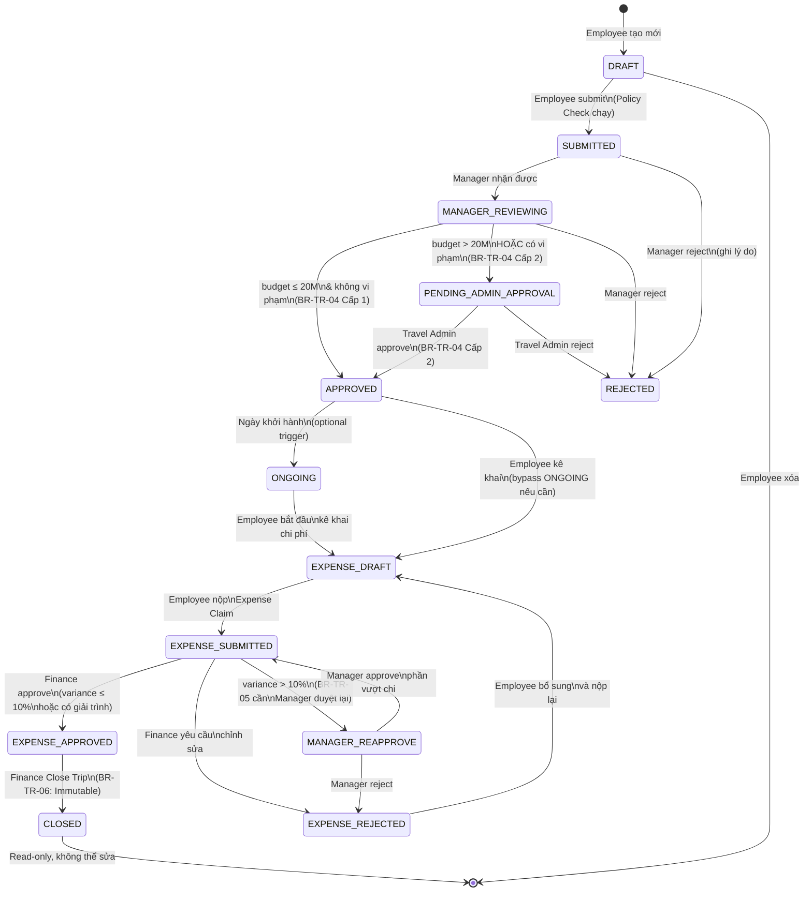

# Architecture — Smart Travel & Business Trip Management

**Dự án:** Smart Travel & Business Trip Management
**Nhóm:** Nhóm 11 — MIS3032_1
**Phiên bản:** v1.0
**Ngày tạo:** 2026-08-28
**Tác giả:** Engineering (Nguyễn Thị Ánh Tuyết) — được tạo theo vai trò System Architect
**Tài liệu tham chiếu:** `PRD.md`, `requirements.md`, `business-rules.md`, `user-stories.md`, `decision-log.md`

---

## Mục lục

1. [Tổng quan kiến trúc](#1-tổng-quan-kiến-trúc)
2. [Technology Stack](#2-technology-stack)
3. [Sơ đồ kiến trúc tổng thể](#3-sơ-đồ-kiến-trúc-tổng-thể)
4. [Sơ đồ luồng Request-Response chính](#4-sơ-đồ-luồng-request-response-chính)
5. [Mô tả chi tiết các thành phần](#5-mô-tả-chi-tiết-các-thành-phần)
   - 5.1 Frontend Layer
   - 5.2 Backend Layer (API Server)
   - 5.3 Service Layer (nội bộ)
   - 5.4 Database Layer
   - 5.5 AI Service
   - 5.6 External Services
6. [Chiến lược Authentication & Authorization (RBAC)](#6-chiến-lược-authentication--authorization-rbac)
7. [Chiến lược Logging & Observability](#7-chiến-lược-logging--observability)
8. [Data Model Overview](#8-data-model-overview)
9. [State Machine — Trip Request Lifecycle](#9-state-machine--trip-request-lifecycle)
10. [Architecture Decision Records (ADR)](#10-architecture-decision-records-adr)
11. [Self-Check: Rủi ro & Biện pháp giảm thiểu](#11-self-check-rủi-ro--biện-pháp-giảm-thiểu)

---

## 1. Tổng quan kiến trúc

### 1.1 Phong cách kiến trúc

Hệ thống áp dụng **Layered Monolith with Service Modules** — một kiến trúc đơn khối được tổ chức theo module nghiệp vụ rõ ràng bên trong. Lý do lựa chọn:

- Quy mô nhóm nhỏ (5 người, 1 kỹ sư engineering), ít overhead vận hành.
- Không có yêu cầu scale độc lập từng dịch vụ trong MVP.
- Dễ debug và trace lỗi hơn distributed system khi team nhỏ.
- Vẫn tách biệt logic theo module để sau này có thể tách microservice nếu cần.

> **ADR liên quan:** ADR-01 (Kiến trúc Monolith vs Microservice)

### 1.2 Nguyên tắc cốt lõi

| Nguyên tắc | Áp dụng cụ thể |
|---|---|
| **Single Source of Truth** | PostgreSQL là nơi duy nhất lưu trạng thái; frontend không cache state nghiệp vụ |
| **Business Logic tập trung ở Server** | Policy Check Engine, Approval Router, Expense Variance, AI Guardrail đều chạy server-side |
| **RBAC tại API Gateway** | Mọi request qua middleware `authGuard` + `roleGuard` trước khi chạm service |
| **Immutability cho CLOSED trip** | Middleware `immutableGuard` chặn mọi write mutation nếu `trip.status === CLOSED` |
| **Structured Logging** | Mọi log output theo chuẩn JSON, không plain text |
| **Atomic Transaction** | Mọi state transition dùng DB transaction (đáp ứng NFR-TR-05) |

---

## 2. Technology Stack

### 2.1 Bảng lựa chọn stack

| Tầng | Công nghệ | Phiên bản khuyến nghị | Lý do chọn | ADR |
|---|---|---|---|---|
| **Frontend** | React + TypeScript | React 18, TS 5.x | Ecosystem lớn, type-safe, SPA phù hợp với dashboard phân quyền nhiều role | ADR-02 |
| **UI Library** | Ant Design (antd) | v5.x | Component enterprise đầy đủ (Table, Form, Notification, Badge), phù hợp dashboard doanh nghiệp | ADR-02 |
| **State Management** | Zustand | v4.x | Lightweight, dễ dùng hơn Redux Toolkit cho quy mô này | ADR-02 |
| **HTTP Client** | Axios | v1.x | Interceptor dễ tích hợp JWT attach & error handling tập trung | — |
| **Backend** | Node.js + Express.js + TypeScript | Node 20 LTS | JavaScript full-stack giảm context switch cho team, TypeScript đảm bảo type safety | ADR-03 |
| **ORM** | Prisma | v5.x | Type-safe query, migration rõ ràng, hỗ trợ tốt với PostgreSQL | ADR-03 |
| **Database** | PostgreSQL | v16 | ACID transaction (NFR-TR-05), Row-Level Security, JSON support cho audit payload | ADR-04 |
| **Authentication** | JWT (Access + Refresh Token) | — | Stateless, dễ implement RBAC qua payload `role` | ADR-05 |
| **AI Service** | Google Gemini API | gemini-1.5-flash | Free tier đủ dùng cho demo, context window lớn, JSON output mode | ADR-06 |
| **PDF Export** | Puppeteer / html-pdf | Puppeteer 22 | Render HTML template thành PDF, hỗ trợ tiếng Việt, không cần font external | — |
| **In-app Notification** | Server-Sent Events (SSE) | — | Đơn giản hơn WebSocket, đủ dùng cho push notification một chiều | ADR-07 |
| **Runtime Environment** | Node.js, chạy local / VPS | — | Không cloud-managed services để giảm chi phí và độ phức tạp cho demo | — |
| **Package Manager** | pnpm | v9.x | Disk space hiệu quả, workspace hỗ trợ monorepo | — |

### 2.2 Cấu trúc thư mục dự án

```
Smart-Travel-Business-Trip-Management/
├── app/
│   ├── frontend/                  # React + TypeScript SPA
│   │   ├── src/
│   │   │   ├── pages/             # Dashboard, TripForm, Approval, Expense...
│   │   │   ├── components/        # Shared UI components
│   │   │   ├── features/          # Feature-sliced: trips, expenses, auth...
│   │   │   ├── services/          # Axios API client wrappers
│   │   │   ├── stores/            # Zustand stores
│   │   │   └── utils/             # Format currency, date, PDF trigger
│   │   └── vite.config.ts
│   │
│   └── backend/                   # Node.js + Express + TypeScript
│       ├── src/
│       │   ├── routes/            # Express routers (trips, expenses, users...)
│       │   ├── controllers/       # Request handlers
│       │   ├── services/          # Business logic modules (xem §5.3)
│       │   ├── middlewares/       # authGuard, roleGuard, immutableGuard, logger
│       │   ├── prisma/            # Schema, migrations, seed
│       │   ├── lib/               # AI client, PDF generator, SSE emitter
│       │   └── utils/             # Policy engine, variance calculator
│       └── tsconfig.json
│
├── docs/                          # Tài liệu dự án
└── .env.example
```

---

## 3. Sơ đồ kiến trúc tổng thể



---

## 4. Sơ đồ luồng Request-Response chính

### 4.1 Luồng tạo Trip Request và Policy Check



### 4.2 Luồng Approval và tự động phân tầng (BR-TR-04)



### 4.3 Luồng AI Generate Itinerary với Guardrail (BR-TR-07)



---

## 5. Mô tả chi tiết các thành phần

### 5.1 Frontend Layer

**Công nghệ:** React 18 + TypeScript 5 + Ant Design v5 + Zustand + Axios

**Vai trò:** Trình bày giao diện, thu thập input, hiển thị state nghiệp vụ từ server. **Không lưu trữ business state** (trip status, approval result) tại client — mọi state phải fetch từ API.

| Module/Page | Mô tả |
|---|---|
| `LoginPage` | Form đăng nhập, lưu Access Token vào memory (không localStorage), Refresh Token vào httpOnly cookie |
| `DashboardPage` | Dashboard phân quyền theo role: tab trạng thái cho Employee; widget "Chờ duyệt" cho Manager/Admin/Finance |
| `TripFormPage` | Form tạo Trip Request; tính per diem hint client-side; hiển thị Policy Check result |
| `ItineraryBuilderPage` | CRUD mốc lịch trình; cảnh báo vượt hotel cap theo role |
| `AIItineraryPanel` | Panel gọi AI, hiển thị Skeleton loading (≤5s NFR-TR-02), preview kết quả |
| `ApprovalPage` | Màn hình Manager/Admin duyệt: tóm tắt trip, policy flags, nút Approve/Reject |
| `ExpenseClaimPage` | Form kê khai chi phí; bảng variance so sánh dự toán vs thực tế |
| `FinanceReviewPage` | Màn hình Finance: bảng đối chiếu, điều kiện enable/disable nút Close |
| `NotificationPanel` | Nhận SSE event, hiển thị badge số đếm và dropdown thông báo |
| `PDFExportButton` | Trigger `GET /trips/:id/export-pdf`, download file tự động |

**Zustand Store** chỉ lưu: `currentUser` (sau login), `uiState` (loading flags, modal open/close). Không lưu trip data.

### 5.2 Backend Layer — API Server

**Công nghệ:** Node.js 20 LTS + Express.js + TypeScript

**Vai trò:** Nhận HTTP request, thực thi middleware chain, dispatch sang Service Layer, trả response.

#### Middleware Chain (theo thứ tự thực thi)

```
Request
  │
  ├─► requestLogger      — ghi structured log mọi request (method, path, ip, user_id nếu có)
  ├─► express.json()     — parse body
  ├─► authGuard          — verify JWT; gắn req.user = {id, role, name}; 401 nếu invalid/expired
  ├─► roleGuard(roles[]) — so sánh req.user.role với roles[] được phép; 403 nếu không match
  ├─► immutableGuard     — (chỉ áp dụng route write của trips) load trip.status; 409 nếu CLOSED
  │
  └─► Controller → Service
```

#### Route — Permission Matrix

| Route | Method | Roles được phép | State điều kiện |
|---|---|---|---|
| `/auth/login` | POST | Public | — |
| `/auth/refresh` | POST | Public | — |
| `/trips` | GET | EMPLOYEE (own), MANAGER, TRAVEL_ADMIN, FINANCE | — |
| `/trips` | POST | EMPLOYEE | — |
| `/trips/:id` | GET | Owner + approvers liên quan | — |
| `/trips/:id/submit` | POST | EMPLOYEE (owner) | `DRAFT` |
| `/trips/:id/approve` | POST | MANAGER | `SUBMITTED` → L1 |
| `/trips/:id/approve` | POST | TRAVEL_ADMIN | `PENDING_ADMIN_APPROVAL` → L2 |
| `/trips/:id/reject` | POST | MANAGER | `SUBMITTED` |
| `/trips/:id/reject` | POST | TRAVEL_ADMIN | `PENDING_ADMIN_APPROVAL` |
| `/trips/:id/itinerary` | CRUD | EMPLOYEE (owner) | Không phải `CLOSED` |
| `/trips/:id/expense` | POST | EMPLOYEE (owner) | `APPROVED` hoặc `ONGOING` |
| `/trips/:id/expense` | GET | Owner, FINANCE | — |
| `/trips/:id/expense/submit` | POST | EMPLOYEE (owner) | expense `DRAFT` |
| `/trips/:id/expense/approve` | POST | FINANCE | expense `SUBMITTED` |
| `/trips/:id/expense/reject` | POST | FINANCE | expense `SUBMITTED` |
| `/trips/:id/expense/reapprove` | POST | MANAGER | expense `SUBMITTED`, `managerReapprovalRequired=true` |
| `/trips/:id/expense/items` | POST/PATCH/DELETE | EMPLOYEE (owner) | expense `DRAFT` hoặc `REJECTED` |
| `/trips/:id/close` | POST | FINANCE | expense `APPROVED` (xem ghi chú ①) |
| `/dashboard` | GET | ALL roles (filtered server-side) | — |
| `/ai/generate-itinerary` | POST | EMPLOYEE | — |
| `/trips/:id/export-pdf` | GET | Owner, FINANCE | trip `APPROVED`+ |
| `/notifications/stream` | GET (SSE) | ALL (authenticated) | — |

> **① Ghi chú UX vs API (L-05 fix):** Màn hình `FinanceReviewPage` có thể hiển thị nút "Approve & Close" gộp cho trường hợp thông thường — nhưng backend **luôn tách thành 2 request riêng**: `POST /expense/approve` → `POST /close`. Frontend phải gọi tuần tự. Nút "Close" chỉ được enable sau khi `expense.status = APPROVED`. Nếu `managerReapprovalRequired = true`, cả hai nút đều bị disable cho đến khi Manager gọi `POST /expense/reapprove`.

### 5.3 Service Layer — Business Logic

Đây là nơi tập trung **toàn bộ business logic**. Controller chỉ là thin wrapper, không chứa logic.

#### TripService

- Quản lý vòng đời Trip Request theo state machine (xem §9).
- Mọi state transition được bọc trong `prisma.$transaction(...)`.
- Sau mỗi transition: gọi `AuditLogger.log(...)` và `NotificationService.emit(...)`.

#### PolicyCheckEngine

Implements toàn bộ Business Rules liên quan đến kiểm tra chính sách:

```typescript
interface PolicyCheckResult {
  passed: boolean;
  violations: PolicyViolation[];
}

interface PolicyViolation {
  code: 'POLICY_VIOLATION_ACCOMMODATION_OVER_BUDGET'
      | 'POLICY_VIOLATION_PER_DIEM_EXCEEDED'
      | 'URGENT_TRIP_NOTICE'
      | 'POLICY_VIOLATION_BUDGET_THRESHOLD';
  detail: string;
  severity: 'WARNING' | 'BLOCKER';
}
```

| Rule | Logic |
|---|---|
| BR-TR-01 | `hotelCostPerNight > HOTEL_LIMIT[user.jobGrade]` → `POLICY_VIOLATION_ACCOMMODATION_OVER_BUDGET` (dùng `jobGrade`: STAFF/MANAGER_GRADE/DIRECTOR, **không phải** `role`) |
| BR-TR-02 | `perDiemAmount > days * PER_DIEM_RATE[destinationType]` → `POLICY_VIOLATION_PER_DIEM_EXCEEDED` |
| BR-TR-03 | `departureDateDiff < 3 working days` → `URGENT_TRIP_NOTICE` |
| BR-TR-04 | `totalBudget > 20_000_000 \|\| violations.length > 0` → đánh dấu cần cấp 2 |

#### ApprovalRouter

- Nhận kết quả PolicyCheck và totalBudget sau khi Manager approve.
- Quyết định: `status = APPROVED` (1 cấp) hay `status = PENDING_ADMIN_APPROVAL` (2 cấp).
- Logic: `if (totalBudget > 20_000_000 || hasViolations) → PENDING_ADMIN_APPROVAL`.

#### ExpenseService

- Tính `variance = (actualTotal - estimatedBudget) / estimatedBudget * 100`.
- Áp dụng BR-TR-05:
  - `variance ≤ 0`: bình thường.
  - `0 < variance ≤ 10%`: yêu cầu trường `justification` không rỗng.
  - `variance > 10%`: block Finance close, cần Manager re-approve trước.
- Check BR-TR-06: nếu trip đã `CLOSED` → throw `TripImmutableError`.

#### AIService

```typescript
async generateItinerary(destination: string, days: number, budget: number): Promise<ItineraryDraft>
```

- Build prompt với constraint `budget_cap = budget` rõ ràng.
- Parse JSON response từ Gemini.
- **Guardrail server-side (BR-TR-07):** kiểm tra `totalEstimatedCost ≤ budget`.
  - Nếu vượt: retry tối đa 2 lần với prompt constraint chặt hơn.
  - Sau 2 lần vẫn fail: ném `AIBudgetGuardrailError`.
- Timeout toàn bộ call: 8 giây (đảm bảo NFR-TR-02 ≤ 5s đến client khi cộng thêm overhead).

#### NotificationService

- Lưu notification vào bảng `notifications` trong DB.
- Emit SSE event đến client đang kết nối qua `GET /notifications/stream`.
- SSE payload: `{ type: 'TRIP_STATUS_CHANGED', tripId, newStatus, message }`.

#### AuditLogger

Ghi vào bảng `audit_logs` mỗi khi có mutation nhạy cảm (NFR-TR-04):

```typescript
interface AuditLogEntry {
  id: string;           // uuid
  userId: string;       // người thực hiện
  entityType: 'TRIP' | 'EXPENSE' | 'ITINERARY';
  entityId: string;
  action: string;       // TRIP_SUBMITTED, MANAGER_APPROVED, EXPENSE_CLOSED...
  previousState: string | null;
  newState: string;
  metadata: Record<string, unknown>; // JSON — context thêm
  timestamp: Date;      // UTC
  ipAddress: string;
}
```

Bảng `audit_logs` chỉ có `INSERT`, **không có `UPDATE` hay `DELETE`** — đảm bảo tính bất biến của audit trail.

#### PDFService

- Dùng Puppeteer render HTML template thành PDF.
- Template gồm: thông tin nhân viên, lịch trình chi tiết, bảng kê chi phí đối chiếu, lịch sử phê duyệt.
- Chỉ cho phép export khi `trip.status IN (APPROVED, CLOSED)`.

### 5.4 Database Layer

**Công nghệ:** PostgreSQL 16 + Prisma ORM

**Vai trò:** Source-of-truth duy nhất cho toàn bộ state nghiệp vụ.

Các bảng chính (xem `data-model.md` để biết chi tiết cột):

| Bảng | Mô tả |
|---|---|
| `users` | Nhân viên, vai trò, manager_id (self-ref), department |
| `trips` | Trip Request với trạng thái, total_budget, policy_result |
| `itinerary_items` | Các mốc lịch trình chi tiết gắn với trip |
| `policy_check_results` | Kết quả Policy Check, danh sách violations (JSON) |
| `approval_records` | Lịch sử từng cấp duyệt: approver, action, comment, timestamp |
| `expenses` | Expense Claim header gắn với trip |
| `expense_items` | Từng khoản chi thành phần |
| `notifications` | Thông báo in-app, trạng thái đã đọc/chưa |
| `audit_logs` | Immutable audit trail (INSERT-only) |

**Chiến lược đảm bảo Integrity (NFR-TR-05):**
- Mọi state transition dùng `prisma.$transaction([...])`.
- Sử dụng `SELECT ... FOR UPDATE` khi đọc trip trước khi update để tránh race condition.
- Foreign key constraints đầy đủ.
- `CHECK constraint` trên cột `status` để chỉ chấp nhận các giá trị hợp lệ.

### 5.5 AI Service (External)

**Công nghệ:** Google Gemini API (gemini-1.5-flash)

- Được gọi từ `AIService` trên server, **client không gọi trực tiếp**.
- API Key lưu trong `.env`, không bao giờ expose ra frontend.
- Prompt template đảm bảo output là JSON có cấu trúc (`response_mime_type: "application/json"`).
- **Guardrail chạy server-side** trước khi kết quả trả về client (BR-TR-07).

### 5.6 External Services (Out of Scope MVP)

Theo D-05, các dịch vụ sau nằm ngoài phạm vi:
- ❌ Agoda / Sabre API (đặt phòng thật)
- ❌ VNPay / Stripe (thanh toán thật)
- ❌ SAP / Oracle ERP
- ❌ Email / SMS notification (chỉ in-app)

---

## 6. Chiến lược Authentication & Authorization (RBAC)

### 6.1 Authentication — JWT Flow

```
[1] POST /auth/login {email, password}
      → Server verify password hash (bcrypt)
      → Tạo: accessToken (JWT, expires 15m) + refreshToken (opaque, expires 7d)
      → refreshToken lưu trong DB (bảng refresh_tokens) + gửi về qua httpOnly cookie
      → accessToken gửi về qua JSON response body

[2] Client lưu accessToken trong memory (React state / Zustand)
      → KHÔNG lưu trong localStorage (tránh XSS)

[3] Mỗi API request: Axios interceptor tự attach
      Authorization: Bearer <accessToken>

[4] Khi accessToken hết hạn (401):
      → Axios interceptor tự call POST /auth/refresh (cookie gửi kèm tự động)
      → Server verify refreshToken trong DB + httpOnly cookie
      → Cấp accessToken mới
      → Retry request gốc

[5] Logout: DELETE /auth/logout
      → Server xóa refreshToken trong DB
      → Client xóa accessToken khỏi memory
```

### 6.2 Authorization — RBAC

Roles trong hệ thống:

| Role | Giá trị trong JWT | Quyền chính |
|---|---|---|
| Employee | `EMPLOYEE` | Tạo trip, xem trip của mình, kê khai expense |
| Manager | `MANAGER` | Duyệt cấp 1 trip của nhân viên dưới quyền |
| Travel Admin | `TRAVEL_ADMIN` | Duyệt cấp 2, xem toàn bộ trip |
| Finance | `FINANCE` | Duyệt expense, close trip |
| Admin | `ADMIN` | Quản lý user (ngoài scope MVP UI, chỉ seed data) |

**Kiểm soát quyền theo 2 lớp:**

1. **Route level** — `roleGuard(allowedRoles[])` middleware: kiểm tra `req.user.role ∈ allowedRoles`. Trả 403 nếu không hợp lệ (NFR-TR-03).

2. **Resource level** — trong Service: kiểm tra ownership (`trip.employeeId === req.user.id`) hoặc department scope (`trip.employee.managerId === req.user.id`).

**Ví dụ code middleware:**

```typescript
// middlewares/roleGuard.ts
export const roleGuard = (...allowedRoles: Role[]) =>
  (req: Request, res: Response, next: NextFunction) => {
    if (!req.user || !allowedRoles.includes(req.user.role)) {
      return res.status(403).json({
        error: 'FORBIDDEN',
        message: `Role '${req.user?.role}' is not authorized for this resource.`
      });
    }
    next();
  };

// middlewares/immutableGuard.ts
export const immutableGuard = async (req: Request, res: Response, next: NextFunction) => {
  const trip = await prisma.trip.findUnique({ where: { id: req.params.id } });
  if (trip?.status === 'CLOSED') {
    return res.status(409).json({
      error: 'TRIP_IMMUTABLE',
      message: 'Trip đã đóng hồ sơ, không thể chỉnh sửa (BR-TR-06).'
    });
  }
  next();
};
```

---

## 7. Chiến lược Logging & Observability

### 7.1 Structured Logging (NFR-TR-04)

Toàn bộ log output theo chuẩn **JSON**, không dùng plain text. Format:

```json
{
  "level": "info",
  "timestamp": "2026-08-28T10:30:00.000Z",
  "requestId": "req_abc123",
  "userId": "usr_xyz789",
  "userRole": "MANAGER",
  "method": "POST",
  "path": "/api/v1/trips/trip_001/approve",
  "statusCode": 200,
  "durationMs": 142,
  "message": "Trip approved by manager"
}
```

**Thư viện:** `pino` (Node.js) — output JSON native, zero-config, performance cao.

### 7.2 Audit Log (NFR-TR-04)

Phân biệt rõ **Application Log** (runtime, debug) và **Audit Log** (nghiệp vụ, bất biến):

| Loại | Lưu ở đâu | Mục đích |
|---|---|---|
| Application Log | Console / file `logs/app.log` | Debug lỗi, trace request |
| Audit Log | Bảng `audit_logs` trong PostgreSQL | Kiểm toán, truy vết ai làm gì |

Các hành động bắt buộc phải có Audit Log:

| Hành động | `action` value |
|---|---|
| Tạo Trip Request | `TRIP_CREATED` |
| Nộp Trip Request | `TRIP_SUBMITTED` |
| Manager Approve | `MANAGER_APPROVED` |
| Manager Reject | `MANAGER_REJECTED` |
| Travel Admin Approve | `ADMIN_APPROVED` |
| Travel Admin Reject | `ADMIN_REJECTED` |
| Thay đổi budget | `BUDGET_UPDATED` |
| Nộp Expense Claim | `EXPENSE_SUBMITTED` |
| Finance Approve Expense | `EXPENSE_APPROVED` |
| Finance Close Trip | `TRIP_CLOSED` |

### 7.3 Error Handling

```typescript
// Cấu trúc error response chuẩn
{
  "error": "POLICY_VIOLATION",          // Machine-readable error code
  "message": "Hotel cost exceeds limit", // Human-readable
  "details": { "limit": 1000000, "actual": 1500000 }, // Context
  "requestId": "req_abc123"             // Để trace trong log
}
```

HTTP Status Code mapping:
- `400` — Validation error (input không hợp lệ)
- `401` — Unauthenticated (token thiếu/hết hạn)
- `403` — Unauthorized (sai role)
- `404` — Resource không tồn tại
- `409` — Conflict (CLOSED trip, duplicate submit)
- `422` — Business rule violation (AI guardrail, expense variance)
- `500` — Unexpected server error (log full stack trace, không expose ra client)

### 7.4 Cách debug lỗi trong production

1. Lấy `requestId` từ response lỗi.
2. `grep requestId logs/app.log` — xem toàn bộ trace của request đó.
3. Nếu cần xem audit: `SELECT * FROM audit_logs WHERE entity_id = '<trip_id>' ORDER BY timestamp`.
4. Nếu lỗi AI: xem log AIService với `level=error` và `requestId`.

---

## 8. Data Model Overview

Sơ đồ quan hệ thực thể tổng quan (chi tiết cột xem `data-model.md`):



---

## 9. State Machine — Trip Request Lifecycle



**Source-of-truth của trạng thái:** Cột `status` trong bảng `trips` (PostgreSQL) — không lưu state ở client hoặc cache.

---

## 10. Architecture Decision Records (ADR)

### ADR-01: Kiến trúc Monolith với Module Pattern

| | |
|---|---|
| **Ngày** | 2026-08-28 |
| **Trạng thái** | Accepted |
| **Bối cảnh** | Dự án có 1 kỹ sư engineering, thời gian phát triển hạn chế (~118 giờ), không có yêu cầu scale độc lập từng dịch vụ. |
| **Quyết định** | Dùng **Layered Monolith** với business logic tách theo Service Module bên trong một codebase duy nhất. |
| **Alternatives đã cân nhắc** | Microservices (quá phức tạp cho team 1 người, overhead DevOps lớn), Serverless Functions (khó manage state và transaction). |
| **Hệ quả** | Đơn giản hóa deploy và debug. Nếu sau này cần tách service, các module đã được thiết kế rõ ràng để migrate. Single process = potential SPOF (giảm thiểu bằng PM2 auto-restart). |

---

### ADR-02: Frontend — React + TypeScript + Ant Design

| | |
|---|---|
| **Ngày** | 2026-08-28 |
| **Trạng thái** | Accepted |
| **Bối cảnh** | Hệ thống là Desktop Web dashboard phức tạp với nhiều role, form phức tạp, table data, notification. NFR-TR-06 yêu cầu desktop ≥1280×720. |
| **Quyết định** | React 18 + TypeScript + Ant Design v5. |
| **Alternatives đã cân nhắc** | Vue 3 + Vuetify (ít familiar hơn với team), Next.js (SSR không cần thiết cho internal app), plain HTML (quá cơ bản cho SPA phức tạp). |
| **Hệ quả** | Ant Design cung cấp sẵn Table, Form, Notification, Badge, Drawer — giảm thời gian xây component. TypeScript giúp type-check API contract giữa FE và BE. |

---

### ADR-03: Backend — Node.js + Express + TypeScript + Prisma

| | |
|---|---|
| **Ngày** | 2026-08-28 |
| **Trạng thái** | Accepted |
| **Bối cảnh** | Team đã chọn React (JavaScript/TypeScript) cho frontend. Cần backend dễ học, type-safe, ORM hỗ trợ tốt PostgreSQL. |
| **Quyết định** | Node.js 20 LTS + Express.js + TypeScript + Prisma ORM. |
| **Alternatives đã cân nhắc** | NestJS (quá opinionated, learning curve cao), Python FastAPI (context switch từ JS), Java Spring Boot (verbose, không phù hợp thời gian). |
| **Hệ quả** | JavaScript full-stack giảm context switch. Prisma cung cấp type-safe query và migration rõ ràng. Express tối giản, dễ kiểm soát middleware chain. |

---

### ADR-04: Database — PostgreSQL

| | |
|---|---|
| **Ngày** | 2026-08-28 |
| **Trạng thái** | Accepted |
| **Bối cảnh** | NFR-TR-05 yêu cầu ACID transaction nguyên tử. Dữ liệu có quan hệ rõ ràng (User → Trip → Expense → AuditLog). Cần `CHECK constraint` cho status enum. |
| **Quyết định** | PostgreSQL 16. |
| **Alternatives đã cân nhắc** | MySQL (ít feature hơn, JSON support yếu hơn), MongoDB (không phù hợp với dữ liệu có quan hệ và ACID mạnh), SQLite (không đủ concurrent write). |
| **Hệ quả** | PostgreSQL hỗ trợ `SELECT ... FOR UPDATE` (chống race condition NFR-TR-05), JSONB cho audit payload, Row-Level Security nếu cần tăng cường sau này. |

---

### ADR-05: Authentication — JWT (Access + Refresh Token)

| | |
|---|---|
| **Ngày** | 2026-08-28 |
| **Trạng thái** | Accepted |
| **Bối cảnh** | Hệ thống có 5 role với quyền khác nhau. NFR-TR-03 yêu cầu RBAC chặt chẽ. Cần stateless auth để dễ scale. |
| **Quyết định** | JWT Access Token (15 phút, lưu trong memory) + Refresh Token (7 ngày, httpOnly cookie + DB). |
| **Alternatives đã cân nhắc** | Session-based (cần sticky session hoặc Redis, phức tạp hơn), OAuth2 (overkill cho internal app không có SSO), API Key (không phù hợp user-facing). |
| **Hệ quả** | Access Token ngắn hạn giảm rủi ro bị đánh cắp. httpOnly cookie cho Refresh Token ngăn XSS đọc token. Role được mã hóa trong JWT payload để roleGuard hoạt động stateless. |

---

### ADR-06: AI Service — Google Gemini API

| | |
|---|---|
| **Ngày** | 2026-08-28 |
| **Trạng thái** | Accepted |
| **Bối cảnh** | REQ-TR-02 yêu cầu AI sinh itinerary. BR-TR-07 yêu cầu server-side guardrail chặn vượt budget. NFR-TR-02 yêu cầu ≤5s. Dự án là demo/academic. |
| **Quyết định** | Google Gemini API (gemini-1.5-flash) với JSON mode. |
| **Alternatives đã cân nhắc** | OpenAI GPT-4o (có chi phí, không free tier tốt), local LLM (latency cao, setup phức tạp), hardcoded mock (không thỏa mãn tính năng AI thật). |
| **Hệ quả** | Gemini Flash có free tier đủ dùng cho demo. JSON mode đảm bảo output parseable. Guardrail được implement server-side nên AI provider có thể thay đổi sau này mà không ảnh hưởng business rule. Rủi ro: phụ thuộc third-party API, cần timeout và fallback. |

---

### ADR-07: Real-time Notification — Server-Sent Events (SSE)

| | |
|---|---|
| **Ngày** | 2026-08-28 |
| **Trạng thái** | Accepted |
| **Bối cảnh** | REQ-TR-11 yêu cầu in-app notification khi trạng thái thay đổi. Notification là một chiều (server → client). |
| **Quyết định** | Server-Sent Events (SSE) qua `GET /notifications/stream`. |
| **Alternatives đã cân nhắc** | WebSocket (hai chiều, phức tạp hơn không cần thiết), Polling (tốn băng thông, độ trễ cao), Push Notification (cần service worker, overkill cho web internal). |
| **Hệ quả** | SSE đơn giản, native browser support, tự động reconnect. Phù hợp notification một chiều. Hạn chế: không scale tốt nếu hàng nghìn concurrent connection (chấp nhận được cho scope demo). |

---

## 11. Self-Check: Rủi ro & Biện pháp giảm thiểu

### 11.1 Single Point of Failure (SPOF)

| Component | SPOF? | Rủi ro | Biện pháp |
|---|---|---|---|
| **Node.js process** | ✅ Có | Process crash → toàn bộ API down | Dùng `PM2` với `--watch` + auto-restart; health check endpoint `GET /health` |
| **PostgreSQL** | ✅ Có | DB down → toàn bộ hệ thống tê liệt | Backup định kỳ (pg_dump); trong production: replica/RDS; với scope demo: chấp nhận |
| **Gemini API** | ✅ Có | API down / quota hết → AI feature fail | Graceful degradation: nếu Gemini fail, trả về lỗi rõ ràng + cho phép user nhập tay; không crash toàn app |
| **JWT Secret** | ✅ Có | Secret bị lộ → toàn bộ token có thể forge | Lưu trong `.env`, không commit; rotate định kỳ; dùng RS256 (asymmetric) trong production |

### 11.2 Security

| Mối đe dọa | Biện pháp hiện tại |
|---|---|
| **Unauthorized access** | `authGuard` + `roleGuard` trên mọi route; HTTP 401/403 |
| **RBAC bypass** | Double-check: route level (roleGuard) + resource level (ownership check trong service) |
| **CLOSED trip bị sửa** | `immutableGuard` middleware chặn mọi write operation (BR-TR-06) |
| **AI budget bypass** | Server-side guardrail trong AIService, không tin tưởng AI output (BR-TR-07) |
| **SQL Injection** | Prisma ORM parameterized query — không raw SQL trong business code |
| **XSS** | Access Token không lưu localStorage; httpOnly cookie cho Refresh Token |
| **CSRF** | SameSite=Strict trên Refresh Token cookie |
| **Race condition (double approve)** | `SELECT ... FOR UPDATE` trong transaction trước khi update trạng thái (NFR-TR-05) |
| **Mass assignment** | Whitelist chặt chẽ các field được phép update trong từng endpoint |

### 11.3 Observability (Debug lỗi thực tế)

| Câu hỏi debug | Cách trả lời |
|---|---|
| "Request nào bị lỗi 500?" | `grep '"statusCode":500' logs/app.log` → xem `requestId`, `path`, `userId` |
| "Trip này bị duyệt bởi ai, lúc nào?" | `SELECT * FROM audit_logs WHERE entity_id='<tripId>' ORDER BY timestamp` |
| "Tại sao Finance không close được?" | Kiểm tra `expense.variance_pct > 10` và `approval_records` xem Manager đã re-approve chưa |
| "AI trả về gì trước khi guardrail reject?" | Tìm log với `action=AI_GUARDRAIL_REJECT` và `requestId` tương ứng |
| "Notification có được gửi không?" | Query `SELECT * FROM notifications WHERE reference_id='<tripId>'` |

### 11.4 Rủi ro khi hệ thống bị quá tải

| Tình huống | Rủi ro | Biện pháp |
|---|---|---|
| **Nhiều user submit trip cùng lúc** | Race condition trên cùng approval record | `SELECT ... FOR UPDATE` trong transaction — đã xử lý |
| **Nhiều SSE connection** | File descriptor limit, memory leak | Giới hạn timeout SSE connection (30s re-connect); cleanup on disconnect |
| **AI call chậm > 5s** | NFR-TR-02 vi phạm, UX kém | Timeout 8s với fallback error message; frontend hiển thị skeleton; không block luồng khác |
| **PDF export nặng** | Puppeteer spawn nhiều Chrome process | Queue PDF job (async), trả về polling URL thay vì block response |
| **DB connection pool cạn** | Timeout query | Prisma connection pool mặc định đủ cho demo; monitor `prisma.$metrics` nếu cần |

---

*Tài liệu này được cập nhật theo vòng lặp sprint. Mọi thay đổi stack hoặc kiến trúc phải có ADR mới và ghi vào `decision-log.md` theo quy ước của nhóm.*
